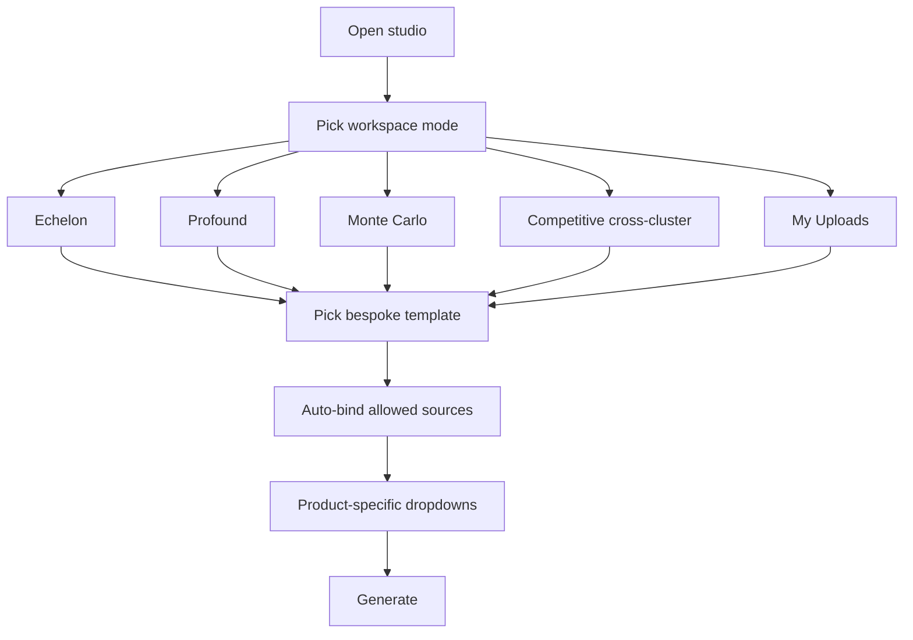

# Cluster-First GTM Studio UX

## Problem

The current studio ([`UnifiedGtmStudio.tsx`](onus-gtm-lite/src/components/gtm/UnifiedGtmStudio.tsx)) exposes too much surface area at once:

- 5 discipline tabs + 20 use-case dropdown + 4 translation preset chips
- [`useEffect` auto-selects all docs](onus-gtm-lite/src/components/gtm/UnifiedGtmStudio.tsx) on load (lines 66–70)
- Checkbox multi-select allows arbitrary mixing of Echelon + Profound + Monte Carlo seeds
- Generic fields (e.g. “Tier-1 asset managers”) don’t match the seeded KB products

## Target experience



**Guiding rules**

| Rule | Behavior |
|------|----------|
| Default selection | **No sources selected** on load; templates auto-select required docs |
| Seed mixing | **Forbidden** across clusters; within a cluster, only what a template declares (usually 1 doc; Competitive may declare 2–3 cross-cluster docs) |
| Uploads | Separate **My Uploads** group; same template *shapes* as seed clusters but grounded only on user uploads |
| Simplify chrome | Remove discipline tabs, generic use-case dropdown, and flat translation preset row from primary flow |

---

## Phase 1 — Config: cluster workspaces and bespoke templates

Add [`onus-gtm-lite/src/config/cluster-workspaces.ts`](onus-gtm-lite/src/config/cluster-workspaces.ts) as the single source of truth (replace [`translation-presets.ts`](onus-gtm-lite/src/config/translation-presets.ts) or re-export from it).

```typescript
export type WorkspaceId = "echelon" | "profound" | "monte-carlo" | "competitive" | "uploads";

export type ClusterTemplate = {
  id: string;
  workspace: WorkspaceId;
  label: string;
  description: string;
  useCaseId: string;           // maps to existing buildTask in use-cases.ts
  documentFilenames?: string[]; // seed docs auto-selected; omitted for uploads workspace
  defaultValues: Record<string, string>;
  fields?: GeneratorField[];   // optional override of use-case fields for this template
};
```

### Echelon templates (from Document A/B/C + Competitive KB)

| Template | Use case | Auto-bound seed doc(s) | Bespoke dropdowns |
|----------|----------|------------------------|-------------------|
| Buyer persona brief | `persona` | Document A only | Persona: CIO/CTO, VP Enterprise Apps, Platform Owner, ServiceNow Architect, MSP practice lead |
| Pain-segment talk track | `persona-objections` | Document A only | Pain segment: Backlog-constrained, MSP-dependent, Modernization, Governance/quality, AI-transformation executive |
| Vertical GTM campaign | `campaign` | Document B only | Vertical: Healthcare, Banking/finserv, Manufacturing, Telecom, Public sector |
| Technical discovery guide | `asset` | Document C only | Use case: Requirements translation, ATF/test generation, Legacy migration, Update-set review, CMDB/governance cleanup |
| MSP displacement narrative | `sales-plays` | Competitive positioning only | Incumbent: Traditional MSP, Global SI, Internal team capacity, ServiceNow Build Agent |
| ServiceNow native battlecard | `battlecard` | Competitive positioning only | Competitor: Now Assist/Build Agent, Devin/Cursor/Copilot, Accenture/Deloitte SI, Status quo MSP |

### Profound templates (GTM strategy playbook)

| Template | Use case | Auto-bound doc | Bespoke dropdowns |
|----------|----------|----------------|-------------------|
| Vertical outbound sequence | `campaign` | Profound GTM playbook | Vertical: B2B SaaS, Financial services, Retail/ecommerce, Travel, Healthcare |
| Mid-funnel objection handler | `persona-objections` | Profound GTM playbook | Objection theme: Rank tracker commoditization, SEO suite consolidation, ROI/proof, Procurement/security, Build vs buy |
| POV / business case | `report` | Profound GTM playbook | Buyer stage: Discovery, Evaluation, Procurement, Pilot/POV |
| SEO-suite battlecard | `battlecard` | Profound GTM playbook | Competitor: Ahrefs/Semrush, Peec/Evertune, AirOps/Jasper, Internal SEO team |

### Monte Carlo templates (Competitive + Industries KB)

| Template | Use case | Auto-bound doc | Bespoke dropdowns |
|----------|----------|----------------|-------------------|
| Platform battlecard | `battlecard` | Competitive analysis only | Competitor: Databricks, Snowflake, Datadog, Salesforce Agentforce, Notion |
| Vertical trust pitch | `sales-plays` | Industry strategy only | Vertical: Financial services, Insurance, Healthcare, Retail/ecommerce, SaaS/B2B tech, Telecom |
| Agent observability narrative | `product-positioning` | Competitive analysis only | Wedge: Data failure vs agent failure, Neutral trust fabric, Lakehouse-native governance counter |
| Industry ROI brief | `report` | Industry strategy only | Vertical + persona: CDO, Head of Data, AI/GenAI lead, Compliance/risk |

### Competitive workspace (only place cross-cluster mixing is allowed)

| Template | Use case | Auto-bound seed doc(s) | Notes |
|----------|----------|--------------------------|-------|
| Cross-vendor landscape | `competitive-landscape` | Echelon competitive + Monte Carlo competitive | Optional third: Profound playbook for AEO category context |
| Unified battlecard | `battlecard` | User picks competitor archetype; template binds 2 competitive docs | Competitor dropdown spans ServiceNow native, Databricks, Datadog, Ahrefs/Semrush |
| Win/loss synthesis | `competitive-win-loss` | Same multi-doc set as landscape | Loss reason: Native platform, SI/MSP incumbent, Point-tool DIY |

### My Uploads workspace (same shapes, upload-only grounding)

Mirror template **labels and field shapes** from above clusters but:

- `documentFilenames` omitted
- `sourcePolicy: "uploads-only"`
- User must select 1+ uploaded docs (checkbox within uploads group only)
- Reuse use cases: `persona`, `campaign`, `battlecard`, `asset`, `report`

Update [`kb-manifest.json`](onus-gtm-lite/data/seeds/kb-manifest.json) with short `description` per doc for UI helper text (optional, 1 line each).

---

## Phase 2 — Selection logic and enforcement

Add [`onus-gtm-lite/src/lib/kb/selection-policy.ts`](onus-gtm-lite/src/lib/kb/selection-policy.ts):

```typescript
// resolveTemplateSources(template, docs) => Set<docId>
// validateSelection(workspace, selectedDocs) => { ok, error? }
// onTemplateChange: clear selection, apply template.documentFilenames
// onManualToggle: block if violates workspace rules
```

**Rules to implement**

1. Remove auto-select-all `useEffect` in [`UnifiedGtmStudio.tsx`](onus-gtm-lite/src/components/gtm/UnifiedGtmStudio.tsx) (lines 66–70).
2. **Seed workspaces**: selection is template-driven; source panel shows bound docs as read-only chips (not free multi-select). Optional: allow switching between templates within same workspace only.
3. **Competitive workspace**: enable multi-select **only** among competitive-class seed docs (Echelon competitive, Monte Carlo competitive, optionally Profound playbook); never mix with Document A/B/C.
4. **Uploads workspace**: checkbox multi-select limited to `!is_seed` docs; never selectable alongside seed docs.
5. Server-side guard in [`kb.functions.ts`](onus-gtm-lite/src/lib/kb.functions.ts) `generateSchema` handler: reject `documentIds` that mix clusters unless `module` is competitive (`battlecard`, `competitive-landscape`, `competitive-win-loss`).

---

## Phase 3 — UI simplification

### Replace primary navigation

| Remove / demote | Replace with |
|-----------------|--------------|
| [`DisciplinePicker`](onus-gtm-lite/src/components/gtm/DisciplinePicker.tsx) | **WorkspacePicker** — 5 large cards: Echelon, Profound, Monte Carlo, Competitive, My Uploads |
| [`UseCaseSelector`](onus-gtm-lite/src/components/gtm/UseCaseSelector.tsx) dropdown | **TemplatePicker** — 4–6 cards per workspace with label + 1-line description |
| Translation preset chip row | Removed ( absorbed into TemplatePicker ) |

New components:

- [`WorkspacePicker.tsx`](onus-gtm-lite/src/components/gtm/WorkspacePicker.tsx)
- [`TemplatePicker.tsx`](onus-gtm-lite/src/components/gtm/TemplatePicker.tsx)
- [`BoundSources.tsx`](onus-gtm-lite/src/components/gtm/BoundSources.tsx) — shows auto-bound docs for seed/competitive templates

### Refactor [`SourcePanel.tsx`](onus-gtm-lite/src/components/gtm/SourcePanel.tsx)

- **Seed groups**: Echelon / Profound / Monte Carlo — display only (no toggles) when a seed template is active; highlight bound docs
- **Competitive group**: checkboxes for allowed competitive seeds only when Competitive workspace active
- **My Uploads group**: always visible at bottom; checkboxes only in Uploads workspace (or when user switches workspace to uploads)
- Remove global **All** button (encouraged bad mixing); keep **Clear** for uploads/competitive only
- Upload button stays in My Uploads header

### Simplify operator column

- Show template description under title instead of generic use-case intro
- Hide brand voice/wiki toggles for Profound/Monte Carlo unless cluster-specific brand seeds are added later (Echelon keeps current [`brand-context.json`](onus-gtm-lite/data/seeds/brand-context.json))
- Rename **F1 Generate** → **Generate draft**
- Collapse history into a smaller accordion by default

### Layout tweak

Reduce header clutter: workspace picker spans full width above the 2-column grid; template picker sits in left column above form fields.

---

## Phase 4 — Wire studio state machine

Refactor [`UnifiedGtmStudio.tsx`](onus-gtm-lite/src/components/gtm/UnifiedGtmStudio.tsx):

```typescript
const [workspace, setWorkspace] = useState<WorkspaceId>("echelon");
const [templateId, setTemplateId] = useState<string>("echelon-persona");
const template = getTemplate(workspace, templateId);

// On workspace change: reset template to first in workspace, clear selection/messages
// On template change: set discipline/useCaseId from template, setValues(defaultValues), auto-bind docs
// canSubmit: template-resolved docs + required fields
```

`applyPreset` and `TRANSLATION_PRESETS` migrate into cluster-workspaces config.

---

## Phase 5 — Tests and fixtures

- Update [`translation-fixtures.json`](onus-gtm-lite/data/seeds/translation-fixtures.json) to reference new template IDs and single-cluster doc bindings (remove Echelon+Profound voice fixture cross-mix unless moved to Competitive workspace)
- Add unit tests for [`selection-policy.ts`](onus-gtm-lite/src/lib/kb/selection-policy.ts): cluster mix rejection, competitive allow-list, uploads-only
- Update [`README.md`](onus-gtm-lite/README.md) with new 3-step flow

---

## Files to change (summary)

| File | Change |
|------|--------|
| `src/config/cluster-workspaces.ts` | **New** — workspaces + ~20 bespoke templates |
| `src/lib/kb/selection-policy.ts` | **New** — source binding + validation |
| `src/components/gtm/WorkspacePicker.tsx` | **New** |
| `src/components/gtm/TemplatePicker.tsx` | **New** |
| `src/components/gtm/BoundSources.tsx` | **New** |
| `src/components/gtm/UnifiedGtmStudio.tsx` | **Major refactor** — remove auto-select, cluster-first state |
| `src/components/gtm/SourcePanel.tsx` | **Refactor** — uploads group, enforced modes |
| `src/lib/kb.functions.ts` | Server-side mix guard on generate |
| `src/config/translation-presets.ts` | Deprecate or thin re-export |
| `data/seeds/translation-fixtures.json` | Align with new templates |
| `README.md` | Document simplified UX |

**Out of scope**: new LLM prompts, new use cases in `use-cases.ts` (reuse existing `buildTask` + bespoke field values), cluster-specific brand-context files (future).

---

## Success criteria

- On load, **zero** sources selected; user sees “Pick a template to bind sources”
- Echelon persona template auto-selects Document A only with ServiceNow-relevant persona dropdown
- Profound outbound template auto-selects Profound playbook with vertical dropdown from Section 5
- Monte Carlo battlecard auto-selects competitive doc with Databricks/Snowflake/Datadog options
- Competitive landscape template can combine Echelon + Monte Carlo competitive docs; other workspaces cannot
- Uploaded files appear only under **My Uploads**; upload templates use same shapes but never include seed docs
- Generate rejects mixed-cluster doc IDs server-side if client bypasses UI
