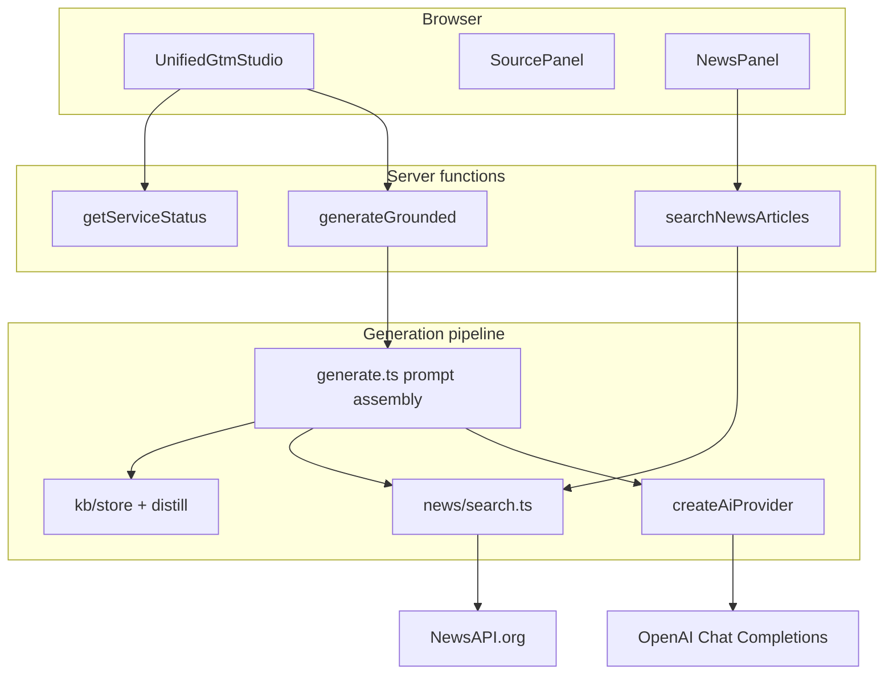

# OpenAI & NewsAPI Integration Guide

Audit of API integrations in **OnusGTM Lite** (`packages/onus-gtm-lite`): what is implemented, how it is validated, how the workflows fit together, and how to get the most value from uploaded documents.

---

## Executive summary

OnusGTM Lite is a **grounded GTM artifact studio**. It does not treat OpenAI or NewsAPI as open-ended chat endpoints. Instead:

| API | Role in the app |
|-----|-----------------|
| **OpenAI** | Synthesizes markdown artifacts from a composed prompt: module instructions, brand voice/wiki, KB excerpts, optional news, and citation rules. |
| **NewsAPI.org** | Supplies **timely external context** (announcements, competitive moves, market framing) that KB docs may not contain or may have outdated. |

Both keys load from the **monorepo root** `.env` (via Vite `envDir` and script `load-env.ts`). Keys never reach the browser; all calls run in TanStack Start server functions.

**Validation status (2026-06-23):**

| Check | Result |
|-------|--------|
| TypeScript (`npm run typecheck`) | Pass |
| News unit tests (`npm run test:news`, 15 tests) | Pass |
| Ingest unit tests (`npm run test:ingest`, 4 tests) | Pass |
| Env accessors centralized in `src/lib/env.ts` | Implemented |
| Startup health banner (`getServiceStatus`) | Implemented |
| Server-side key isolation | Confirmed (no `VITE_*` key exposure) |

---

## Architecture



**Grounding rule:** at least one source is required — KB document(s) **or** enabled news search.

---

## OpenAI integration audit

### API surface used

The app uses a single OpenAI endpoint pattern:

| OpenAI feature | Used? | Implementation |
|----------------|-------|----------------|
| Chat Completions (`/v1/chat/completions`) | Yes | `src/lib/ai/openai.ts` |
| System + user messages | Yes | Module prompt + assembled user prompt |
| Model selection | Partial | `OPENAI_MODEL` env default; optional `model` in generate schema (UI does not expose picker) |
| `max_tokens` | Yes | Fixed at 4096 |
| `temperature` | Yes | Fixed at 0.4 |
| Retry on 429 / 5xx | Yes | One retry after 800ms |
| Error mapping (401, 429) | Yes | Actionable error messages |
| Streaming | No | Full response waited synchronously |
| JSON / structured outputs | No | Free-form markdown only |
| Tools / function calling | No | — |
| Embeddings / RAG at vector DB | No | RAG is filesystem chunk retrieval, not embeddings |
| Vision / file uploads to OpenAI | No | Files ingested locally first |
| Assistants API | No | — |

### Where OpenAI is invoked

| Call site | Trigger | Purpose |
|-----------|---------|---------|
| `runGroundedGeneration` | User clicks **Generate** or **Send follow-up** | Primary artifact generation |
| `distillDocument` | Upload / seed when `DISTILL_ON_INGEST=true` | Optional LLM summary instead of heuristic distillate |

All paths go through `createAiProvider()` → `openaiProvider()` when `AI_PROVIDER=openai` (default).

### Prompt structure sent to OpenAI

**System message:**

1. Module persona (`MODULE_SYSTEM` in `src/lib/prompts/modules.ts`) — e.g. battlecard analyst, campaign architect
2. Dual citation rules (KB `[Doc title · p.N]` + news `[Publisher · YYYY-MM-DD · headline]`)
3. Brand wiki sections (optional)
4. Voice do/don't rules (optional)

**User message:**

1. Task string from use-case form (`buildTask`)
2. Editor notes (`extraContext`)
3. Follow-up block (refinement turns)
4. KB distillates + ranked chunk excerpts (up to ~280k chars budget)
5. Recent news block (when enabled)

### Alternate provider note

Setting `AI_PROVIDER=lovable` routes generation through the Lovable gateway instead of OpenAI. OpenAI-specific env vars are bypassed; `LOVABLE_API_KEY` is required. Health check reflects this via `getServiceStatus`.

### Audit findings — OpenAI

**Correctly implemented:**

- Centralized config via `getOpenAiConfig()` / `assertServerEnv()`
- Keys loaded from repo-root `.env` in dev and scripts
- Fail-fast with clear errors when key missing
- Consistent `AiProvider` interface for generate + distill

**Intentional limitations (not bugs):**

- No streaming — acceptable for batch GTM artifact generation
- Fixed temperature/tokens — tuned for factual, cite-heavy output
- No UI model picker — reduces operator error; power users can pass `model` via API/schema

**Optional improvements (out of current scope):**

- Expose model selector in Operator Console
- Structured output (JSON schema) for machine-readable battlecards
- Token usage logging for cost visibility

---

## NewsAPI.org integration audit

### API surface used

| NewsAPI endpoint | Used? | Parameters sent |
|------------------|-------|-----------------|
| `GET /v2/everything` | Yes | `q`, `from`, `sortBy`, `language`, `domains`, `pageSize`, `apiKey` |
| `GET /v2/top-headlines` | Yes | `category`, `language`, `pageSize`, `q` (optional), `apiKey` |
| `GET /v2/sources` | No | — |
| Pagination (`page`) | No | First page only (`pageSize` 1–20) |
| `to` date filter | No | Implicit “until now” |
| `searchIn` (title/description/content) | No | Default NewsAPI behavior |
| `country` (headlines) | No | — |
| `excludeDomains` | No | — |

### Server functions

| Function | Method | Purpose |
|----------|--------|---------|
| `searchNewsArticles` | POST | Preview/search for NewsPanel article picker |
| `generateGrounded` (news block) | POST | Fetches news again at generation time (cached) |

### Caching

In-memory TTL cache keyed by search params (`NEWS_CACHE_TTL_SEC`, default 900s). Preview and generate share cache when params match.

### UI controls (`NewsPanel`)

| Control | Maps to |
|---------|---------|
| Include recent news | `news.enabled` |
| Search query | `news.query` (falls back to task text on generate) |
| Recency (7 / 30 / 90 days) | `news.recencyDays` → `from` on `/everything` |
| Mode (keyword / top headlines) | `news.mode` |
| Category | `news.category` (headlines mode) |
| Sort (relevancy / publishedAt) | `news.sortBy` |
| Domains | `news.domains` |
| Article count | `news.pageSize` |
| Preview & checkbox list | `searchNewsArticles` + `news.articleIds` |

Discipline-aligned query chips live in `src/config/news-presets.ts`.

### Audit findings — NewsAPI

**Correctly implemented:**

- Server-only API key
- Response parsing with error surfacing (`status !== "ok"`)
- Stable article IDs (SHA-256 of URL) for selection persistence
- Prompt formatting with publisher/date/headline citation template
- Validation: keyword mode requires query; top-headlines does not
- Free-tier UX note in UI (30-day archive limit)

**Known constraints:**

| Constraint | Impact |
|------------|--------|
| Developer plan ~30-day history | **90-day recency** may return errors or empty sets on free tier — prefer 7 or 30 days |
| Truncated `content` field | NewsAPI often appends `[+N chars]`; model sees description + partial content |
| No pagination | Large result sets beyond `pageSize` are not fetched |
| Ephemeral news | Articles are not saved to KB; each generate re-fetches (cached briefly) |
| Generate without preview | All fetched articles included unless `articleIds` narrows selection |

**Validation:** 15 unit tests cover query derivation, article mapping, response parsing, and prompt formatting. Live API calls are not run in CI (require `NEWS_API_KEY`).

---

## End-to-end workflows

### Workflow 1 — KB-grounded artifact (default)

1. Run `npm run seed:kb` to load seed markdown from `packages/dependencies/`
2. Select workspace/cluster documents in **Sources tree**
3. Choose discipline → use case → fill form fields
4. Optionally enable brand voice / wiki
5. **Generate** → OpenAI receives KB distillates + ranked chunks + task

**Best for:** Personas, battlecards, campaigns, pillars — anything that must reflect **your** positioning docs with `[Doc title · p.N]` citations.

### Workflow 2 — KB + news (maximum context)

1. Select 1–3 focused KB docs (same cluster, or competitive cross-cluster set)
2. Enable **Include recent news**
3. Set query or use preset chips; **Preview articles** and deselect noise
4. Generate competitive report, battlecard, or market brief

**Best for:** Artifacts that need **proof of timely market motion** (partner announcements, competitor launches) while keeping product claims anchored in KB.

### Workflow 3 — News-only draft

1. Deselect all KB sources (or upload workspace with no selection)
2. Enable news with a strong query
3. Generate

**Best for:** Quick external landscape scans. Output will lack internal voice/positioning unless you add editor notes or enable brand wiki.

### Workflow 4 — Follow-up refinement

1. After first draft, use **Follow-up refinement** chat
2. Same KB/news context re-sent with prior output

**Best for:** Shortening, tone shifts, adding sections — without re-running the full form.

### Workflow 5 — Upload custom knowledge

1. Upload PDF, Markdown, or DOCX via **Sources tree**
2. Document is chunked + heuristically distilled on ingest
3. Select uploaded doc(s) in **My Uploads** workspace (cannot mix with seed docs)

**Best for:** Customer briefs, RFP excerpts, workshop notes — proprietary inputs not in seed library.

---

## Value in application context

### What OpenAI adds

OpenAI is the **synthesis engine**. It does not store your GTM knowledge; it transforms retrieved evidence into operator-ready markdown:

- 20 use cases across 5 disciplines (briefs, battlecards, campaigns, KPI frameworks, etc.)
- Module-specific system personas enforce artifact shape
- Citation rules reduce hallucination and tie claims to sources
- Brand voice/wiki inject consistent tone without re-uploading style guides each session

Without OpenAI (or Lovable substitute), the app is ingest + search only — no artifact output.

### What NewsAPI adds

NewsAPI adds **temporal grounding** KB files cannot reliably provide:

- Recent competitor announcements
- Industry trend hooks for campaigns and reports
- “Why now” framing for executive summaries
- External validation links (URL included in prompt block)

News complements KB; citation rules instruct the model to prefer KB for product/persona facts and news for market timing.

### Combined value proposition

| Layer | Source | Answers |
|-------|--------|---------|
| Strategy & positioning | KB seed docs | Who we are, how we compete, personas, verticals |
| Brand consistency | `brand-context.json` | Voice, wiki, pillars |
| Market timing | NewsAPI | What changed recently in the market |
| Artifact form | Module system + use case | What deliverable format to produce |

---

## Maximizing value: document structure & file types

The quality of grounded output depends heavily on **how source documents are structured at ingest**. The pipeline is:

```
Upload → extract pages → chunk (~4500 chars) → distillate index → rank by task → prompt
```

### Markdown (`.md`) — **recommended**

Markdown receives the richest treatment:

| Feature | Benefit |
|---------|---------|
| `#` / `##` / `###` headings | Section-aware virtual pages (~4000 chars), `heading_path` on chunks |
| Named sections | Heuristic distillate finds **Purpose**, **Category definition**, **Executive read** |
| Tables & lists | Preserved as text for battlecards and competitive maps |
| Inline links | Model can reference external sources already in your doc |

**Structure guidelines:**

```markdown
# Document title

## Executive read
One-paragraph category definition and strategic frame.

## Purpose of this document
What this doc is for and who should use it.

## Category definition
How you define the market category.

## Section name
Evidence-dense content with specific claims, preferably one idea per subsection.
```

**Why this works:** `parseMarkdownSections` builds a section index used in distillates; `rankChunksByTask` surfaces task-relevant sections when many docs are selected; citations `[Doc title · p.N]` map to virtual page numbers.

Seed docs in `packages/dependencies/` (Echelon, Profound, Monte Carlo) exemplify this pattern.

### PDF (`.pdf`) — **good for legacy assets**

| Aspect | Behavior |
|--------|----------|
| Extraction | `unpdf` — one page per PDF page |
| Headings | Not detected — no `heading_path` |
| Whitespace | Collapsed to single spaces |
| Citations | `[Doc title · p.N]` maps to PDF page number |

**Guidance:**

- Prefer text-native PDFs (not scanned images — OCR is not implemented)
- Use clear page breaks for logical sections
- Keep dense tables on separate pages when possible
- For competitive matrices, Markdown re-authors often outperform PDF

### DOCX (`.docx`) — **usable but weakest**

| Aspect | Behavior |
|--------|----------|
| Extraction | `mammoth` raw text only |
| Structure | Entire doc → **single virtual page** |
| Headings | Lost unless manually styled as plain text markers |
| Chunking | Large docs split at 4500-char boundaries mid-paragraph |

**Guidance:**

- Export to Markdown before upload when structure matters
- If DOCX is required, use explicit heading lines (`## Section`) even if Word styles exist — mammoth does not preserve heading hierarchy for the chunker
- Best for short one-pagers, email drafts, or unstructured notes

### File type comparison

| Format | Section metadata | Distillate quality | Citation precision | Recommendation |
|--------|------------------|--------------------|--------------------|----------------|
| Markdown | Excellent | Excellent | High (section + page) | Primary format for KB building |
| PDF | Page only | Moderate | Page-level | Legacy / shared decks |
| DOCX | Poor | Moderate | Single-page refs | Convert to MD when possible |

---

## Selection & workspace rules (KB value)

To avoid generation errors and maximize coherence:

| Rule | Reason |
|------|--------|
| One seed doc per artifact (except Competitive workspace) | Keeps prompt focused; multi-doc ranking kicks in only when >3 docs |
| Do not mix seed docs with uploads | Enforced by `validateGenerationDocuments` |
| Do not mix clusters (Echelon + Profound) except competitive artifacts | Prevents contradictory positioning |
| Use **Competitive** workspace + competitive use cases for cross-cluster battlecards | Allows Echelon + Monte Carlo competitive docs together |
| Match doc cluster to use case | See README seed doc table (personas → Echelon A, industry strategy → Monte Carlo) |

---

## Operating checklist for maximum value

### Setup

- [ ] `OPENAI_API_KEY` in repo-root `.env`
- [ ] `NEWS_API_KEY` for timely artifacts (optional but high leverage for competitive/report modules)
- [ ] `npm run seed:kb` after clone or doc updates
- [ ] Customize `data/seeds/brand-context.json` for your voice

### Per session

- [ ] Pick the smallest sufficient doc set (1 seed doc is often ideal)
- [ ] Fill all required use-case fields — they become the task string OpenAI optimizes for
- [ ] For competitive/report modules: enable news, preview, curate 4–8 articles
- [ ] Use translation presets as starting points for Echelon workflows
- [ ] Review citations in output — missing `[Doc title · p.N]` suggests weak source structure or empty KB match
- [ ] Use follow-up refinement instead of regenerating from scratch

### Document authoring for upload

- [ ] Prefer Markdown with hierarchical headings
- [ ] Include Purpose / Category / Executive sections for better distillates
- [ ] Keep sections under ~4000 characters where possible for clean virtual pages
- [ ] Avoid image-only PDFs
- [ ] Convert DOCX to MD before upload for battlecards and personas

### Optional power settings

| Env var | Effect |
|---------|--------|
| `DISTILL_ON_INGEST=true` | LLM-written distillate on upload (uses OpenAI; slower, richer summaries) |
| `OPENAI_MODEL` | Change model for all generation |
| `NEWS_CACHE_TTL_SEC` | Adjust news cache duration |
| `AI_PROVIDER=lovable` | Swap OpenAI for Lovable gateway |

---

## Key file reference

| Path | Role |
|------|------|
| `src/lib/env.ts` | Env accessors + health status |
| `src/lib/ai/openai.ts` | OpenAI Chat Completions wrapper |
| `src/lib/ai/provider.ts` | Provider factory |
| `src/lib/generate.ts` | Prompt assembly + AI + news fetch |
| `src/lib/news/client.ts` | NewsAPI HTTP client |
| `src/lib/news/search.ts` | Search orchestration + cache |
| `src/lib/news/format.ts` | News prompt block formatting |
| `src/lib/kb/ingest.ts` | PDF / MD / DOCX extraction |
| `src/lib/kb/distill.ts` | Distillates + chunk ranking |
| `src/lib/kb.functions.ts` | Server API surface |
| `src/components/gtm/NewsPanel.tsx` | News UI selectors |
| `src/components/gtm/UnifiedGtmStudio.tsx` | Main operator shell |
| `src/lib/prompts/modules.ts` | Module personas + citation rules |

---

## Summary

OpenAI and NewsAPI are integrated as **complementary grounding layers** inside a disciplined GTM workflow — not as generic chat APIs. OpenAI synthesizes cite-heavy artifacts from module prompts and retrieved context; NewsAPI injects recency for market-facing claims.

Implementation is **functionally sound** for the designed scope: centralized env loading, server-side keys, validated schemas, tested news parsing/formatting, and ingest tests confirming Markdown superiority.

The highest ROI comes from **structured Markdown KB docs**, **focused source selection**, **news curation for competitive artifacts**, and **brand context** — with PDF and DOCX as fallback formats that sacrifice section-level precision.
